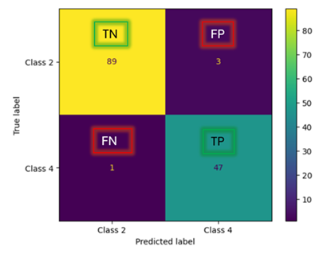
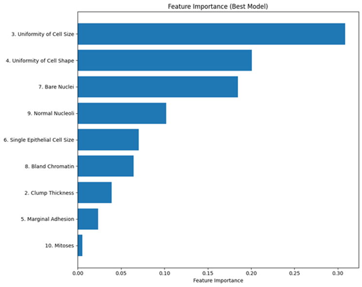

# Breast Cancer Classification with Machine Learning

This project compares several supervised machine learning models for binary breast cancer classification using the Breast Cancer Wisconsin (Original) dataset. The workflow cleans the dataset, handles missing values, evaluates multiple classifiers with repeated stratified cross-validation, compares SMOTE and non-SMOTE training strategies, and reports final performance on a held-out test set.

The best model in the original experiment was a Random Forest classifier without SMOTE, reaching 97.14% test accuracy on the held-out test set.

Final Random Forest test-set metrics:

| Class | Precision | Recall | F1-score | Support |
| --- | ---: | ---: | ---: | ---: |
| Benign, class 2 | 0.9889 | 0.9674 | 0.9780 | 92 |
| Malignant, class 4 | 0.9400 | 0.9792 | 0.9592 | 48 |





## Dataset

The project uses the [Breast Cancer Wisconsin (Original) dataset from the UCI Machine Learning Repository](https://archive.ics.uci.edu/dataset/15/breast%2Bcancer%2Bwisconsin). It contains 699 records, 9 cytological feature columns after removing the sample identifier, and a binary target:

- `2`: benign
- `4`: malignant

The raw dataset is not included in this repository. See [data/README.md](data/README.md) for download and placement instructions.

## Methodology

- Removed the sample identifier column because it is not predictive.
- Converted missing `Bare Nuclei` values encoded as `?` into missing values.
- Used median imputation inside each modeling pipeline.
- Used an 80/20 stratified train-test split with `random_state=42`.
- Tuned models using `GridSearchCV` with repeated stratified 5-fold cross-validation and 5 repeats.
- Compared each model with and without SMOTE to evaluate class imbalance handling.
- Evaluated the selected model on the held-out test set using accuracy, precision, recall, F1-score, confusion matrix, and Random Forest feature importance.

## Models Compared

- Decision Tree
- Random Forest
- Extra Trees
- Support Vector Machine
- Histogram-based Gradient Boosting

## Project Structure

```text
.
|-- assets/
|   |-- confusion_matrix.png
|   `-- feature_importance.png
|-- data/
|   `-- README.md
|-- notebooks/
|   `-- breast_cancer_modeling.ipynb
|-- reports/
|   `-- breast_cancer_ai_project_report.docx
|-- results/
|   `-- README.md
|-- src/
|   `-- train.py
|-- CV_PROJECT_BLURB.md
|-- README.md
`-- requirements.txt
```

